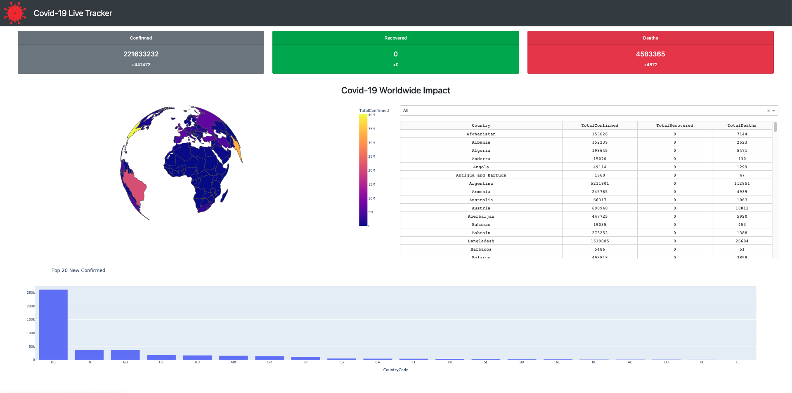

# Covid-19 Live Tracker

### Introduction
A web dashboard is built in Python, [Dash](https://dash.plot.ly/) and charts made in [Plotly](https://plot.ly/). 

 

### Data Source
https://api.covid19api.com/summary

### Tutorials
Firstly, clone the repository to your computer:
```
git clone https://github.com/nguyenduchuy271197/covid19-live-tracker.git
cd covid19-live-tracker
```

To get up & running, create a venv, activate & run:
```
pip install virtualenv
virtualenv venv
source venv/bin/activate
```

Install depedencies from `requirements.txt`:
```
pip install -r requirements.txt
```

Run the dashboard web
```
python3 app.py
```

### Live Dashboard
https://plotly-covid19-dashboard.herokuapp.com/